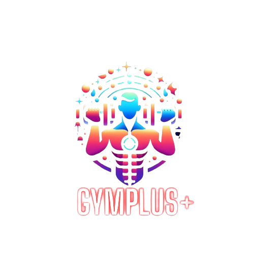
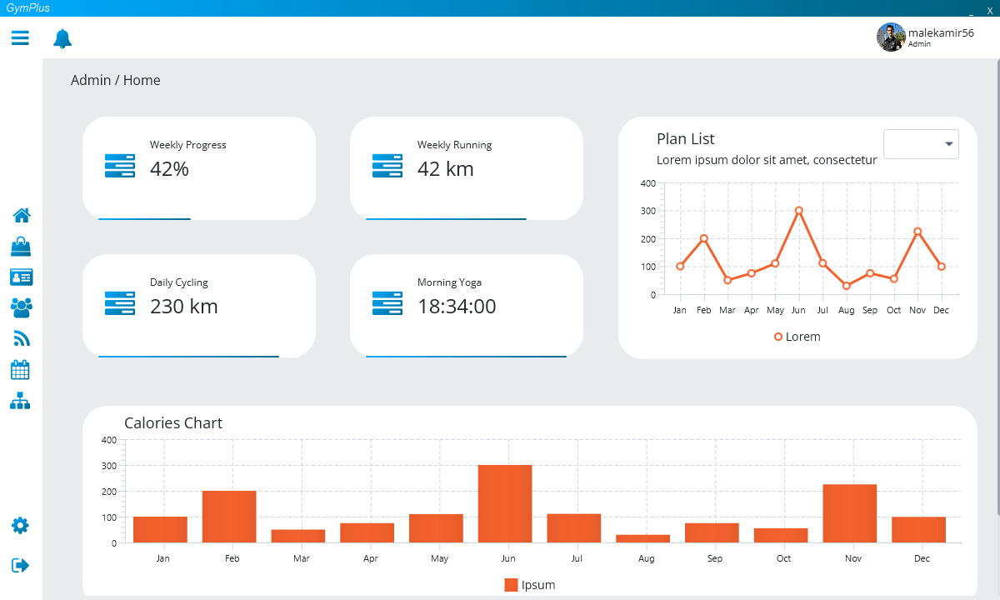

 

  

  <h3 align="center">GymPlus</h3>

  

    A Gym Management Software in JavaFX and Symfony.
     
     
    <a href="https://github.com/Jev1337/GymPlus"><strong>Explore the docs »</strong></a>
     
     
    <a href="https://github.com/Jev1337/GymPlus">View Demo</a>
    .
    <a href="https://github.com/Jev1337/GymPlus/issues">Report Bug</a>
    .
    <a href="https://github.com/Jev1337/GymPlus/issues">Request Feature</a>
  

    

## Table Of Contents

* [About the Project](#about-the-project)
* [Built With](#built-with)
* [Getting Started](#getting-started)
  * [Prerequisites](#prerequisites)
  * [Installation](#installation)
* [Usage](#usage)
* [Roadmap](#roadmap)
* [Contributing](#contributing)
* [License](#license)
* [Authors](#authors)
* [Acknowledgements](#acknowledgements)

## About The Project

## Getting Started

You just have to clone the Repo and run, make sure to install the Prerequisites.

### Prerequisites

This is an example of how to list things you need to use the software and how to install them.
* JavaFX [https://openjfx.io/](https://openjfx.io/)
* Symphony [https://symfony.com/](https://symfony.com/)
* MySQL via XAMPP [https://www.apachefriends.org/index.html](https://www.apachefriends.org/index.html)

## Usage

The only thing you need to do is to run the project and you are good to go. One note however is that in order to create an Admin account you have to create a Member account with the sign up
then change the role in the database to Admin. This is a temporary solution and will be fixed in the future.

## Roadmap

See the [open issues](https://github.com/Jev1337/GymPlus/issues) for a list of proposed features (and known issues).

## Contributing

Contributions are what make the open source community such an amazing place to be learn, inspire, and create. Any contributions you make are **greatly appreciated**.
* If you have suggestions for adding or removing projects, feel free to [open an issue](https://github.com/Jev1337/GymPlus/issues/new) to discuss it, or directly create a pull request after you edit the *README.md* file with necessary changes.
* Please make sure you check your spelling and grammar.
* Create individual PR for each suggestion.
* Please also read through the [Code Of Conduct](https://github.com/Jev1337/GymPlus/blob/main/CODE_OF_CONDUCT.md) before posting your first idea as well.

### Creating A Pull Request

1. Fork the Project
2. Create your Feature Branch (`git checkout -b feature/AmazingFeature`)
3. Commit your Changes (`git commit -m 'Add some AmazingFeature'`)
4. Push to the Branch (`git push origin feature/AmazingFeature`)
5. Open a Pull Request

## License

Distributed under the MIT License. See [LICENSE](https://github.com/Jev1337/GymPlus/blob/main/LICENSE.md) for more information.

## Acknowledgements

* [ShaanCoding](https://github.com/ShaanCoding/)
* [Othneil Drew](https://github.com/othneildrew/Best-README-Template)
* [ImgShields](https://shields.io/)
